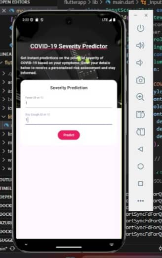

# 🚀 COVID-19 Severity Prediction Model Deployment

## 🎯 Mission
The goal of this project is to develop and deploy a machine learning model that predicts the severity level of COVID-19 infection based on patient symptoms and demographic data. The model is accessible via a FASTAPI and integrated into a mobile application for real-time predictions.

---

## 📊 Dataset Description & Source
### 🔎 Use Case (Non-Generic)
This project focuses on predicting **COVID-19 severity** (mild, moderate, severe) rather than general infection detection, making the use case specialized and non-generic.

### 📚 Dataset Richness (Volume & Variety)
- **Volume:** 3000+ patient records
- **Variety:** Includes symptom features (Fever, Dry Cough, Fatigue), demographic data (Age, Gender), and exposure indicators (Contact with infected persons).

### 🗂 Source
Dataset obtained from **Kaggle - COVID-19 Symptoms and Severity Dataset**:  
[https://www.kaggle.com/datasets/iamhungundji/covid19-symptoms-checker](https://www.kaggle.com/datasets/iamhungundji/covid19-symptoms-checker)

### 📈 Meaningful Visualizations Impacting Training
#### 1. Correlation Heatmap
*Reveals relationships between features influencing severity predictions.*


#### 2. Fever Symptom Distribution
*Shows how Fever is distributed across patients, impacting the model's understanding of symptom severity.*


---

## 🤖 Models Implementation
### ✅ Implemented Models:
- **Linear Regression**
- **Decision Tree Regressor**
- **Random Forest Regressor**

### 📉 Model Evaluation Metric:
- **Mean Squared Error (MSE)** used to compare models.
- **Best Performing Model (Lowest MSE)** saved and used for deployment.

### 🔮 Single Data Point Prediction Example:
```python
sample = X_test.iloc[0]
prediction = best_model.predict([sample])
print(f"Predicted Severity Score: {prediction}")
```

### 📈 Final Linear Regression Plot:
*Visualizing the linear relationship after training.*


---

## 🖥 API Deployment (FastAPI)
### ✅ API Features:
- **Endpoint:** `/predict`
- **Public Swagger UI:** [View Swagger Docs](https://linear-regression-model-9-145n.onrender.com/docs)
- **CORS Middleware:** Enabled for cross-platform access (Mobile app tested)
- **Pydantic Validation:** Applied for input data structure
- **Datatype Constraints:** Enforced on each variable for reliability

### 🚀 Example JSON Input:
```json
{
  "fever": 101.5,
  "tiredness": 7,
  "age": 45,
  "contact_with_infected": 1
}
```

---

## 📱 Mobile App (Flutter)
### ✅ Mobile App Features:
- **Prediction Page:** Interactive user form
- **Text Boxes:** Matches model input features
- **Submit Button:** Sends data to the API
- **Result Display:** Severity level prediction shown on screen

#### 📸 Example Screenshot:


---


---


## 🎥 Video Demo Highlights
- **Live Mobile App Prediction**
- **Swagger API Test**
- **Model Performance Explanation (MSE, Loss Curve)**
- **Model Justification (Random Forest chosen due to lowest loss)**
- **Presenter Camera On**
- **Clear and Concise within 2 minutes**

✅ **Video Link:** [Demo Video](assets/video_demo.mp4) *(Replace with your video path or YouTube link)*

---

## 📂 Project Structure:
```
├── app.py   # FastAPI backend
├── model.pkl   # Saved best model (Random Forest)
├──           
├── Linear_regression
│   ├── multivariate.ipynb
│
│   └── Cleaned_data.csv # COVID-19 dataset
├── mobile_app/           # Flutter project directory
├── README.md             # Project documentation
└── video_demo.mp4        # Video demonstration
```

---


---

## 🎯 Conclusion
This project demonstrates the full machine learning pipeline:
✅ Data Collection  
✅ Model Training & Evaluation  
✅ Model Deployment via API  
✅ Mobile Integration  
✅ End-to-End Demo

---
